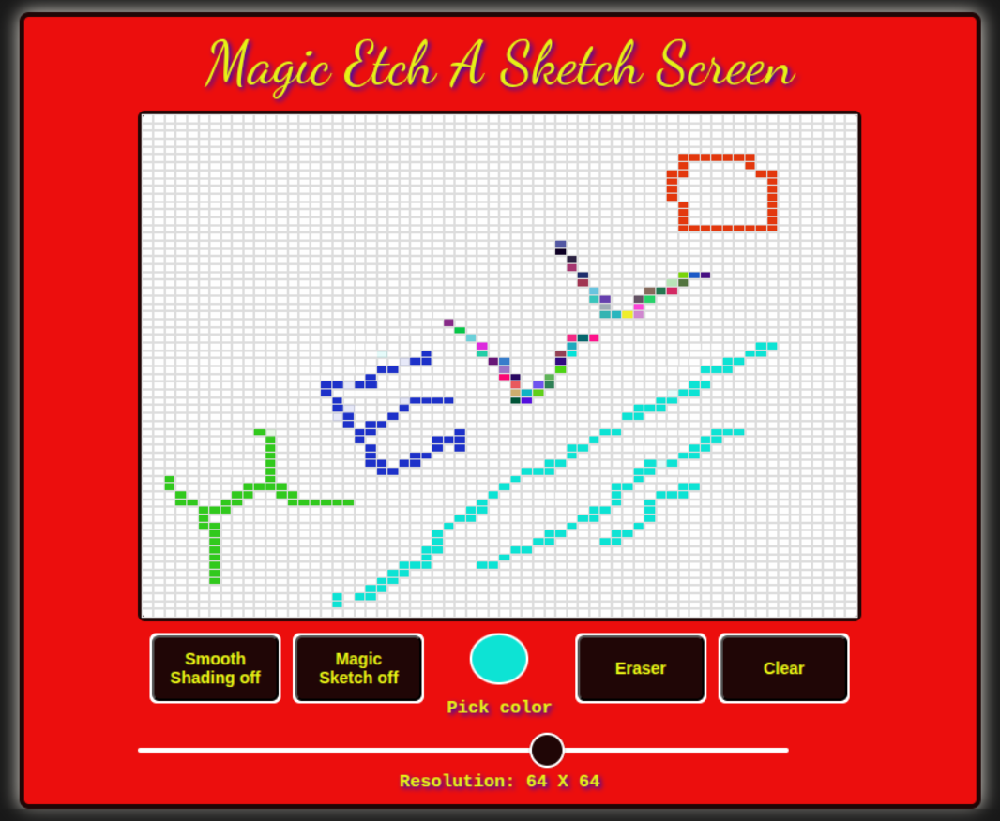

# Etch-A-Sketch

This is a simple Etch-A-Sketch simulation using vanilla JavaScript, HTML, and CSS. It allows users to draw on a grid by moving a mouse pointer while holding the left button and also by simply clicking on the grid to make slight shading.

## Features
- Adjustable grid resolution from (1 by 1) to (100 by 100) cells
- Color picker to select drawing colors
- Toggler between erasing and drawing modes
- Smooth shading effect mode
- Random color shading effect mode

## References
- https://en.wikipedia.org/wiki/Etch_A_Sketch